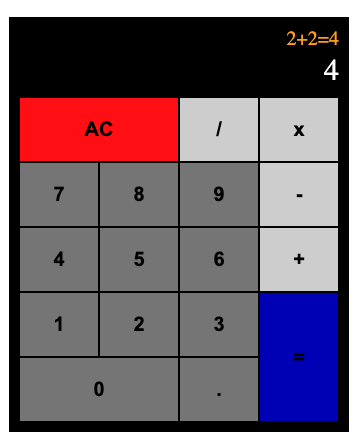

<h1 align="center">📱 Calculator 🟰</h1>

  

<h2>
This project is a simple calculator.
</h2>

## 💻 Project

It is possible to click the number and the operator buttons to build up the formula. After clicking the equal button, the calculator will calculate the result of the formula. By clicking the clear button, result and formula will be erased.

## 🚀 Technologies

This project was developed using the following technologies:

- HTML
- JavaScript
- TypeScript
- React
- Redux
- SASS
- Git e Github

## 🔖 How to access it

- Download the zip file, download the modules needed with <code>npm install</code>, run <code>npm run dev</code> on the terminal and access localhost on a browser.
- [Click here to see it online]()
